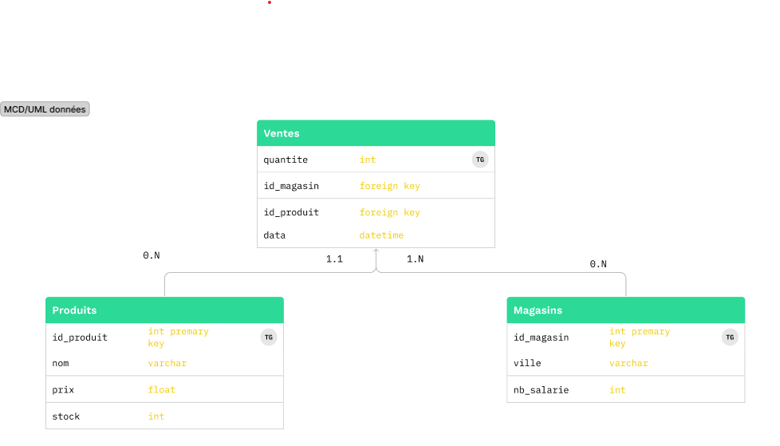

# Analyse de Ventes - README

## Contenu du Répertoire

- `hello_world.py`: Le script principal qui crée la base de données, importe les données et effectue des analyses SQL.
- `data/`: Dossier contenant les fichiers CSV de ventes, produits et magasins.

## Instructions d'Utilisation

1. Assurez-vous d'avoir Python 3.8 (ou version supérieure) installé sur votre machine.
2. Installez les dépendances en exécutant `pip install -r requirements.txt`.
3. Exécutez le script en utilisant la commande `docker-compose up --build`.

## MCD


## Étapes Réalisées par le Script

#### a. Chiffre d'Affaires Total

```sql
SELECT SUM(Quantite * Prix) AS Chiffre_affaires_total
FROM Ventes
JOIN Produits ON Ventes.ID_Reference_produit = Produits.ID_Reference_produit;
```

#### b. Ventes par Produit
```sql
SELECT Nom, SUM(Quantite) AS Total_Ventes
FROM Ventes
JOIN Produits ON Ventes.ID_Reference_produit = Produits.ID_Reference_produit
GROUP BY Nom;
```
#### c. Ventes par Région
```sql
SELECT Ville, SUM(Quantite) AS Total_Ventes
FROM Ventes
JOIN Magasins ON Ventes.ID_Magasin = Magasins.ID_Magasin
GROUP BY Ville;

```
Chiffre d'affaires total:
   Chiffre_affaires_total
0                 5268.78

Ventes par produit:
         Nom  Total_Ventes
0  Produit A            24
1  Produit B            27
2  Produit C            15
3  Produit D            21
4  Produit E            35

Ventes par région:
        Ville  Total_Ventes
0    Bordeaux            19
1       Lille             7
2        Lyon            21
3   Marseille            27
4      Nantes            17
5       Paris            20
6  Strasbourg            11